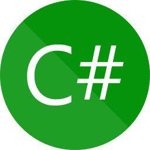

## 👨‍💻 About Me

---

Welcome to my code garage where I make and break things.

I'm Gopalakrishnan / GK, a Software engineer with a decade of experience in testing and developing enterprise
applications.

> ⚙️ I like automating everything around. Am I being smart? Nah! just too lazy to repeat things!
>
> 🥰 Fell in love with hacking. Please don't ask me to hack facebook accounts though!
>
> 😎 Passion for developing software. At times, I switch on my developer mode!
>
> 👌 Python makes my life easier, unlike the one in the wild!
>
> 😍 Vue and React makes it beautiful, Angular, I'm sorry!

### Know more:

&nbsp;

## ⭐ Favorites

---

### Employee Portal

- Full stack web application for managing employee data.

- **Technologies used:** React, Node.js, SQL server

- **Link**: https://github.com/gkcodez/sern-employee-portal

### Bug bounty reports hackerone

- Automation tool to fetch bug bounty reports from hackerone.

- **Technologies used:** Python

- **Link**: https://github.com/gkcodez/bug-bounty-reports-hackerone

### Portfolio

- Portfolio web application built with next.js and typescript.

- **Technologies used:** Next.js, Typescript, Tailwind CSS

- **Link**: https://github.com/gkcodez/next-portfolio

### Autobot

- Web application with most used web elements for UI test automation practice.

- **Technologies used:** React.js, Tailwind CSS

- **Link**: https://github.com/gkcodez/autobot

### Pomodoro

- Pomodoro application for productivity.

- **Technologies used:** Next.js, Tailwind CSS

- **Link**: https://github.com/gkcodez/next-pomodoro

### Tools and Technologies

---

#### Automation

     &nbsp;
     &nbsp;

#### Languages

     &nbsp;
     &nbsp;
     &nbsp;

#### Web development

     &nbsp;
     &nbsp; 
     &nbsp; 
     &nbsp;
     &nbsp; 
     &nbsp; 
    
     &nbsp; 
     &nbsp; 

#### Mobile Application Development

     &nbsp; 
     &nbsp; 

#### CI/CD

   &nbsp;
 &nbsp;
     &nbsp; 
     &nbsp; 
     &nbsp;

#### Databases

     &nbsp; 

#### API

     &nbsp; 
     &nbsp;

#### Miscellaneous

     &nbsp;
     &nbsp; 
     &nbsp; 
     &nbsp; 

